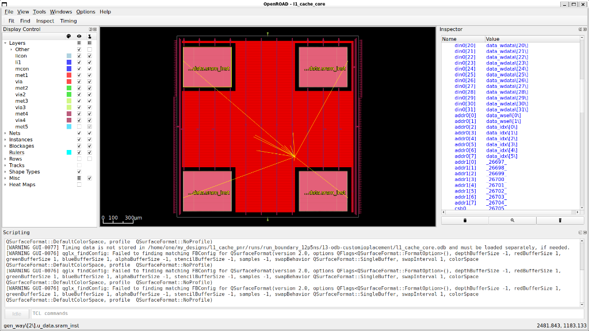

# Data Cache — Sky130 PnR

4KB, 4-way set-associative data cache taken from RTL through synthesis and place-and-route using open-source tools and the Sky130 PDK.

**Project website**: *(coming soon)*

## Specifications

**Cache Organization**
- 4KB total, 4-way set-associative, 64 sets, 16-byte cache line (4 words x 32 bits)
- 32-bit address: tag[31:10] (22 bits) | set index[9:4] (6 bits) | word offset[3:2] (2 bits) | byte offset[1:0] (2 bits)

**Write Policy**
- Write-back with write-allocate
- Per-way dirty bit, writeback only on eviction of a valid+dirty line

**Replacement Policy**
- Tree-based Pseudo-LRU, 3 bits per set stored as a binary tree (bit[0] = root, bit[1] selects way 0/1, bit[2] selects way 2/3)
- Updates on every hit and refill, prefers invalid ways before consulting PLRU tree

**FSM**
- 8 states: IDLE, LOOKUP, MISS_SELECT, WRITEBACK_REQ, WRITEBACK_WAIT, REFILL_REQ, REFILL_WAIT, REFILL_COMPLETE
- Hit latency: 2 cycles (cycle 1 = SRAM address setup, cycle 2 = tag compare + data return)
- Clean miss: 3 FSM cycles + 4 memory transfers
- Dirty miss: 3 FSM cycles + 8 memory transfers (4 writeback + 4 refill)

**Memory Interface**
- 32-bit word-at-a-time, 4 transactions per cache line
- CPU interface: req_valid, req_we, req_addr[31:0], req_wdata[31:0], req_wstrb[3:0], resp_valid, resp_rdata[31:0], resp_stall

**Storage**
- 4 tag arrays: register files, 64 entries x 22 bits each (one per way)
- 4 data arrays: Sky130 SRAM macro (sky130_sram_1kbyte_1rw1r_32x256_8), 1KB per way, 8-bit address = {index[5:0], word_sel[1:0]}, only port 0 used
- Valid bits: flat 256-bit FF vector (64 sets x 4 ways)
- Dirty bits: flat 256-bit FF vector
- PLRU tree: 64 entries x 3 bits, FF array
- Write merging via byte strobes done in FSM before SRAM write (macro always gets full 32-bit merged word)

## Directory Structure

```
src/                   rtl source (systemverilog)
sram_macros/           openram sram macro files (.lef, .lib, .sp, etc.)
configs/               pnr config iterations (librelane json configs)
scripts/               utility scripts (antenna analysis, eco fixes, run comparisons)
equivalence/           formal equivalence checking scripts (yosys-based lec)
pin_order.cfg          io pin ordering constraint
PNR_ITERATIONS.md      log of all pnr iterations and what changed
```

## Tools Used

| Tool | Purpose |
|---|---|
| Yosys | RTL synthesis |
| OpenROAD / LibreLane | Place and route |
| Sky130 PDK | Standard cell library (sky130_fd_sc_hd) |
| OpenRAM | SRAM macro generation |
| Icarus Verilog | Simulation |
| Magic | DRC / SPICE extraction |

## RTL Architecture

The cache is built from 5 modules:

- **data_cache_core** — top-level FSM, hit detection, writeback/refill logic
- **data_array** — wraps the sky130 sram macro, one instance per way
- **tag_array** — register-based tag storage, 64 sets x 22-bit tags per way
- **pseudo_lru** — tree-based replacement policy, 3 bits per set
- **sky130_sram_blackbox** — behavioral model for synthesis/LEC (substituted with actual macro in physical design)



## PnR Flow

The design went through 18+ PnR iterations to reach signoff. See [PNR_ITERATIONS.md](PNR_ITERATIONS.md) for the full history.

Key challenges solved:
- SRAM macro PDN integration (custom power grid geometry for OpenRAM macros, bridging VPWR/VGND to vccd1/vssd1)
- Antenna violation repair (iterative config tuning with heuristic diode insertion)
- Hold timing closure on nominal corners
- Floorplan exploration (central donut layout caused wire detours, switched to L-shape boundary with macros at corners)

### DRC Status
DRC is clean for all standard cell logic. There are some remaining violations internal to the OpenRAM SRAM macros (unknown layers from the OpenRAM GDS that are not in Magic's Sky130 tech file). These are waivable since the SRAM macros are pre-verified IP from the OpenRAM project.

## Equivalence Checking

5-stage formal verification was set up using Yosys:
1. RTL vs post-synthesis
2. Post-synthesis vs post-CTS
3. Post-CTS vs post-routing
4. Post-routing vs final
5. RTL vs final (end-to-end signoff)

Run all stages: `cd equivalence && bash run_all_lec.sh`

Note: there were some equivalence mismatches related to SRAM blackboxing and async reset handling in Yosys. These are known limitations of the equiv_simple approach with blackboxed macros and are considered waivable since the SRAM instances are preserved structurally through the flow.

## Timing

- Setup and hold timing met on nominal corners (TT 1.8V 25C, FF -40C 1.95V)
- SS corner (1.6V 100C) has setup violations due to the inherently slow sky130 process at extreme conditions and SRAM lib PVT characterization limitations

## License

MIT License — see source file headers.
